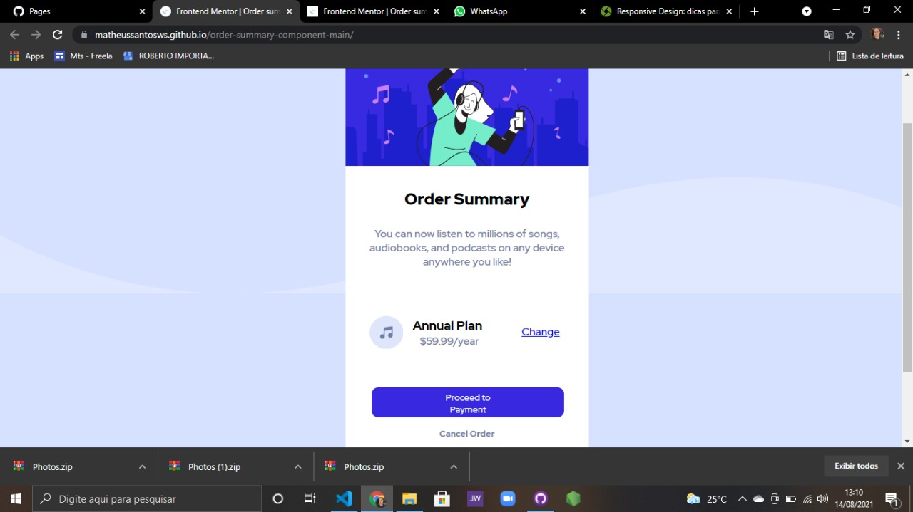

# Order summary component

Essa é a solução para o desafio [Order summary component](https://www.frontendmentor.io/challenges/order-summary-component-QlPmajDUj). Os desafios de Frontend Mentor ajudam você a melhorar suas habilidades de programação por construir projetos realistas.

## Tabela de conteúdos

- [Visão Geral](#visao-geral)
  - [O desafio](#o-desafio)
  - [Screenshot](#screenshot)
  - [Links](#links)
- [Meu processo](#meu-processo)
  - [Construído com](#construido-com)
  - [O que eu aprendi](#o-que-eu-aprendi)
  - [Desenvolvimento contínuo](#desenvolvimento-continuo)
- [Autor](#autor)
- [Agradecimentos](#agradecimentos)

## Visão Geral

### O desafio

Usuários devem ser capazes de:

- Veja o layout ideal, dependendo do tamanho da tela do dispositivo
- Ver estados de foco para elementos interativos

### Screenshot

### Links

- URL do site online: [Live on Netlify](https://matheussantosws.github.io/order-summary-component-main/)

### Construído com

- Marcação semantica HTML5
- Propriedade do CSS3
- Flexbox
- Abordagem Mobile-first

### O que eu aprendi

- Esse foi um desafio muito bom, porque consegui entender como funciona na prática as DIVs, o flexbox, e container e suas funcionalidades. E os Breakpoints para cada resolução de tela de 320px a 1020.

### Desenvolvimento contínuo

- Eu estou querendo ainda mais solidificar meus conhecimentos em flexbox para melhor mais pra frente esse layout ou até mesmo deixar o código mais enxuto.

## Autor

- Matheus

- Instagram - [@matheus_santosof](https://www.instagram.com/matheus_santosof/)
